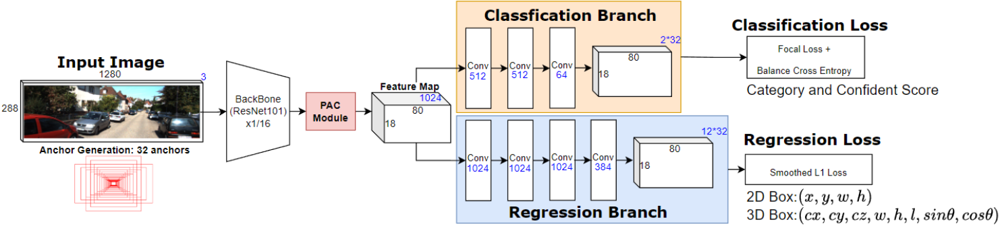

# Perspective-aware Convolution for Monocular 3D object detection
Jia-Quan Yu, Soo-Chang Pei

[[`arXiv`](https://arxiv.org/abs/1911.10194)]


<div align="center">
  
</div><br/>

[](https://www.youtube.com/watch?v=avHUyR5P6o4)

## Installation
```bash
pip install -r requirement.txt
```
or manually check dependencies.

```bash
# build ops (deform convs and iou3d), We will not install operations into the system environment
./make.sh
```
## Environment
OS: Ubuntu 20.04.6 LTS \
GPU: RTX Geforce 3090 \
python : 3.10.12 \
pytorch : 2.0.1 \
cuda1 : 11.7 \
torchvision: 0.15.2

## Training
Train with baseline settings(Ground-aware network)
```
python scripts/train.py --cfg_path="config/pac/baseline.py"
```

Train with perspective-aware convolution module
```
python scripts/train.py --cfg_path="config/pac/pac_module.py"
```
Train with scene-aware copy-paste data augmentation method
```
python scripts/train.py --cfg_path="config/scene-aware/kitti_seg_solid_10_obj_3_zJitter_sceneAware.py"
```
Train with depth-aware anchor generation method
```
python scripts/train.py --cfg_path="config/das/das.py"
``` 

## Evaluate on validation set
```
python ./scripts/test.py --cfg_path="config/pac/pac_module.py" \
                         --gpu=0 \
                         --checkpoint_path="exp_output/pac/pac_module/checkpoint/Yolo3D_24.pth" \
                         --split_to_test="val" \
```
## Inference on test set (no label)
```
python ./scripts/test.py --cfg_path="config/pac/pac_module.py" \
                         --gpu=0 \
                         --checkpoint_path="exp_output/pac/pac_module/checkpoint/Yolo3D_latest.pth" \
                         --split_to_test="test" \
```
## Inference on test sequence (no label)
```bash
python ./scripts/test.py --cfg_path="config/pac/pac_module.py" \
                         --gpu=0 \
                         --checkpoint_path="exp_output/pac/pac_module/checkpoint/Yolo3D_latest.pth" \
                         --split_to_test="test_sequence" \
```


## Demo result
<div align="center">
  
</div><br/>